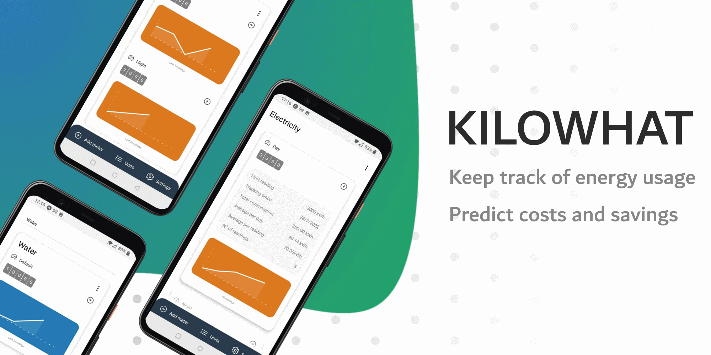

# Kilowhat

An open source mobile application to keep track of your energy usage.



## Features

 - Keep track of energy use by meter
 - View metrics
 - Support for dual meters
 - Predict costs and savings
 - Setup reminders to enter meter readings (TODO)
 - View metrics by energy type (TODO)

## Run locally

Kilowhat is an Expo application, so you will need to have the [Expo CLI](https://docs.expo.dev/get-started/installation/) installed.

To start up the application locally, run the following commands:

```shell
# Install dependencies
expo install 

# Run application with local debugger
expo start
```

You can then open kilowhat using [Expo Go](https://expo.dev/client).